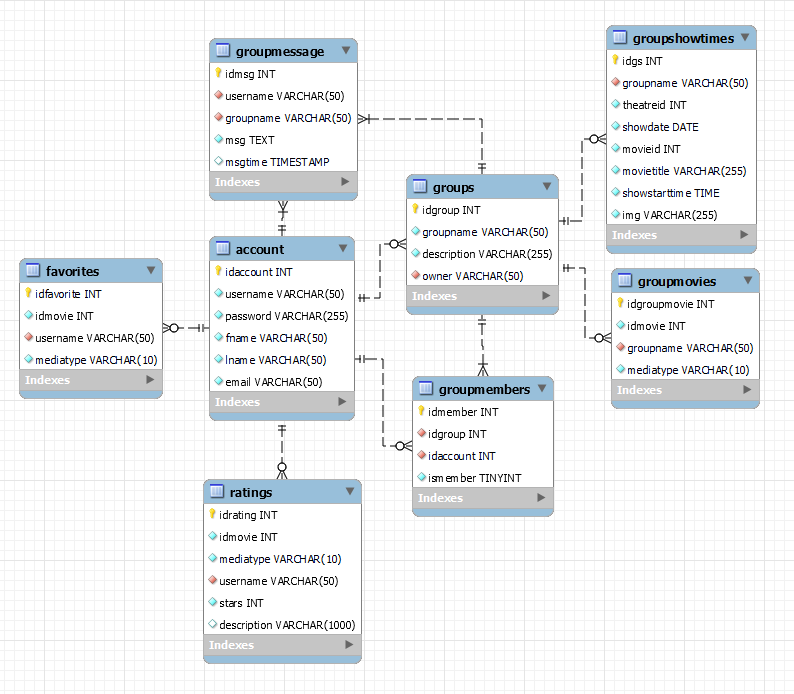
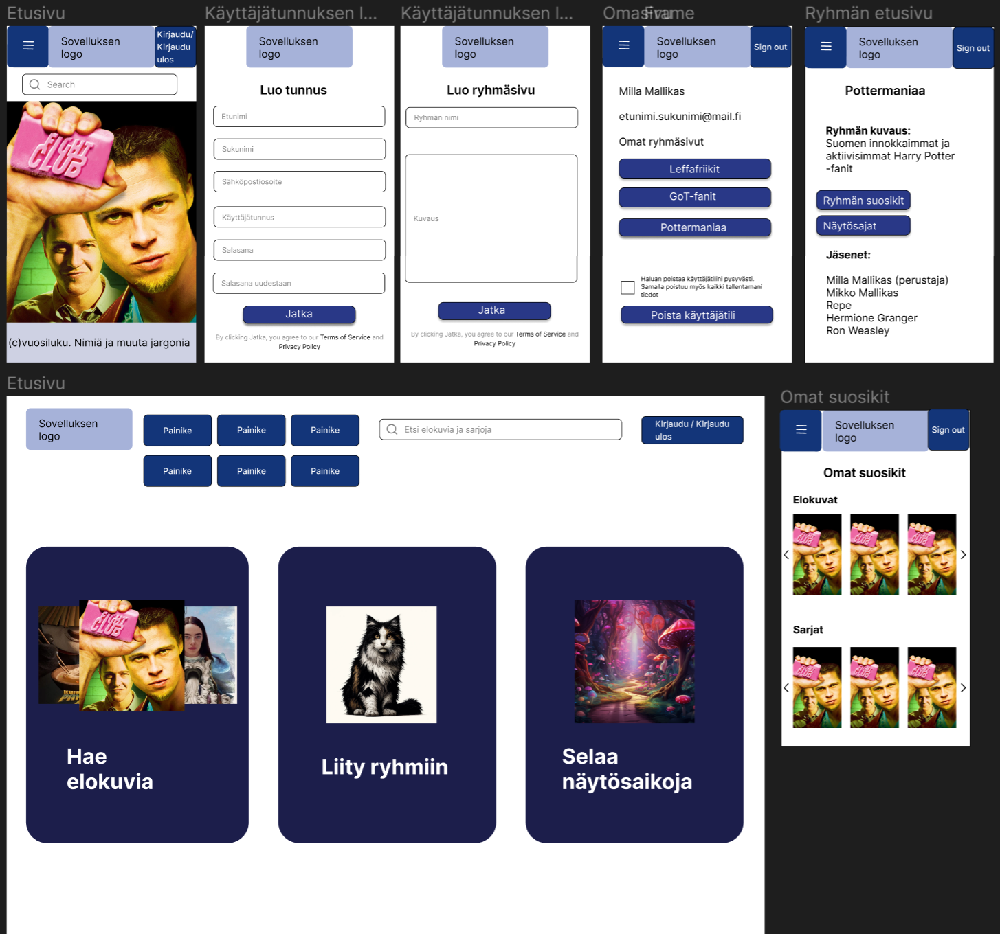

# **Leffaistuinpeli - Elokuvaharrastajien sivusto**

## Projektin esittely

Projektin tavoitteena oli kehittää ryhmätyönä selaimessa toimiva verkkosivusto elokuvaharrastajille, hyödyntäen The Movie Databasen ja Finnkinon avointa dataa. Sivuston suunnitteluun sisältyy toimintoja sekä kirjautumattomille että kirjautuneille käyttäjille, ja sen on tarkoitus olla käyttäjäystävällinen sekä tietokoneen suurella näytöllä että mobiililaitteilla.

*KUVA 1. Leffaistuinpelin etusivu*

Kirjautumattomat käyttäjät voivat suorittaa elokuvahakuja ja etsiä mielenkiintoisia elokuvia suodattimien avulla. He voivat myös lukea elokuvien lyhyitä esittelytekstejä sekä tutkia Finnkinon tulevia näytösaikoja. Lisäksi sivustolla on mahdollisuus rekisteröityä ja luoda henkilökohtaiset tunnukset.

Kirjautuneet käyttäjät voivat kaiken edellä mainitun lisäksi luoda omia ryhmiä ja liittyä muiden käyttäjien luomiin ryhmiin. Ryhmissä jäsenet voivat lisätä mieluisia elokuvia ja sarjoja sekä keskustella keskenään ryhmän valitsemista aiheista. Kirjautuneet käyttäjät voivat myös luoda omat sivut, joille voi lisätä suosikkielokuvia, -sarjoja ja Finnkinon näytösaikoja. He voivat arvostella elokuvia tähtien avulla yhdestä viiteen olevalla asteikolla ja antaa lyhyitä arviointitekstejä.

## Esittely projektin teknologioista

Projektissa käytimme Reactia frontendin rakentamiseen ja Node.js:ää backendin kehittämiseen. Tietojen tallentamiseen ja hallintaan käytimme PostgreSQL-tietokantaa. Lisäksi hyödynsimme Expressiä API-rajapintojen rakentamiseen ja Axiosia HTTP-kutsujen tekemiseen. Suunnitteluvaiheessa käytimme Figmaa käyttöliittymän suunniteluun.

## Projektin tekijät ja roolitus

Tämän projektin tekijöihin kuuluivat [Antre Ahonen](https://github.com/antreahonen), [Taneli Heikkilä](https://github.com/TaneliNH), [Juho Kultala](https://github.com/Kuljuho), [Tuomas Jurvansuu](https://github.com/TuomasJurvansuu) ja [Jaakko Mattila](https://github.com/mattilja88). Taneli Heikkilä toimi pääosin ryhmän vetäjänä. Muita rooleja olivat esimerkiksi ohjelmoija ja suunnittelija. Jokainen projektin jäsen toteutti näitä rooleja omalta osaltaan vaihtelevasti. Tehtävänjako tapahtui siten, että projektiin kuuluvat tehtävät jaettiin kaikkien kesken.

Kaikki ryhmän jäsenet tekivät koodia omilla sovituilla vastuualueillaan. Tarvittaessa ryhmän jäsenet auttoivat toisiaan projektin edetessä, jos esimerkiksi koodaamisen kanssa tuli ongelmia. Discordin ja WhatsAppin välityksellä käytiin keskustelua tehtävien jaosta sekä siitä, miten kukin toteuttaa omaa rooliaan projektissa. Roolitus onnistui pääasiassa hyvin. 

## Esittely tietokantasuunnitelmasta

### Luokkakaavion tarkoitus

Luokkakaavio kuvaa projektimme tietokannan rakennetta. Tietokannan tarkoituksena on hallita käyttäjätilejä, ryhmiä ja niiden jäseniä sekä ryhmien elokuvia ja näytösaikoja sekä yksittäisen käyttäjän tallentamia suosikkeja ja arvosteluja.

*KUVA 2. Projektin luokkakaavio*

### Käyttäjätilit ja ryhmät

Käyttäjät luovat tunnuksen rekisteröitymisen yhteydessä, syöttäen perustietoja kuten etunimi, sukunimi ja sähköposti. Uniikki käyttäjänimi on pakollinen. Kirjautuneena käyttäjät voivat tallentaa elokuvia ja tv-sarjoja suosikkilistoihinsa, jotka haetaan avoimen datan lähteestä ja tallennetaan favorites-tauluun. Käyttäjät voivat myös luoda ryhmiä sovellukseen. Ryhmän luojasta tulee automaattisesti ryhmän omistaja.

### Ryhmien toiminnallisuudet

Ryhmätoimintojen kautta jäsenet voivat lähettää liittymispyyntöjä, jotka hyväksyttäessä muuttavat ismember-kentän arvon trueksi, mikä tarkoittaa että jäsen on hyväksytty ryhmään omistajan toimesta. Ryhmien jäsenet voivat lisätä ryhmän sivulle elokuvia ja tv-sarjoja sekä Finnkinon näytösaikoja. Elokuvien ja tv-sarjojen sekä näytösaikojen tiedot haetaan avoimen datan lähteistä. Tiedot näistä tallentuvat groupmovies sekä groupshowtimes-tauluihin. Ryhmän sivulta löytyy jäsenille tarkoitettu chat, jossa voidaan käydä ryhmänvälisiä keskusteluja. Chat toimii ja kommunikoi tietokannasta löytyvän groupmessage-taulun avulla.

### Elokuvien ja sarjojen arvostelut

Käyttäjät voivat arvostella elokuvia ja tv-sarjoja antamalla tähtiä ja kirjoittamalla arvostelutekstejä, jotka tallentuvat ratings-tauluun. Arvosteluja voi selata myös kirjautumaton käyttäjä. Käyttäjät voivat myös luoda oman suosikkilistan haluamistaan elokuvista ja tv-sarjoista. Suosikit tallentuvat tietokannan tauluun favorites. Listan pystyy jakamaan muille yksilöllisellä URL-osoitteella.

## Esittely käyttöliittymästä

Alla olevassa kuvassa näkyvässä projektin käyttöliittymäsuunnitelmassa käytimme apuna Figmaa. Aluksi keräsimme yhteen projektin vaatimukset ja tavoitteet sekä ryhmän omat näkemykset. Näiden pohjalta aloimme laatia alustavia luonnoksia käyttöliittymän pääkomponenteista.  

*KUVA 3. Projektin käyttöliittymäsuunnitelma*

Suunnittelu perustui mobiili ensin -periaatteeseen, mutta hahmottelimme samalla, miltä sovelluksen etusivu näyttäisi tietokonenäkymässä. Yksi keskeinen osa responsiivisen sivuston toteuttamisessa oli mobiilinäkymään suunniteltu hampurilaisvalikko, joka mahdollisti tehokkaan tilankäytön. Lopulta sivuston ulkonäkö vastasi hyvin alkuperäistä suunnitelmaamme, kuten voitte havaita alla olevasta linkistä. 

### Linkki julkaistulle nettisivulle

Https://leffaistuinpeli.onrender.com

### Sovelluksen esittely

(https://www.youtube.com/watch?v=6kzl6SzgHRg)

*KUVA 4. Leffaistuinpelin elokuvahaku*
